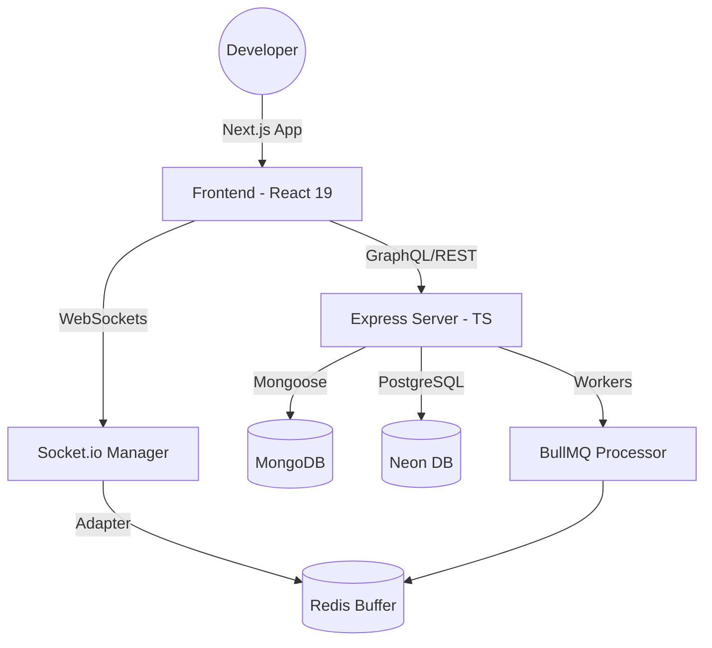

# <div align="center"><br/>CODIE</div>

<div align="center">
  
  **The Next-Generation Real-time Collaborative Development Environment**
  
  [](https://nextjs.org/)
  [](https://react.dev/)
  [](https://nodejs.org/)
  [](https://www.typescriptlang.org/)
  [](https://tailwindcss.com/)
  [](https://kubernetes.io/)

</div>

---

## 🚀 Overview

**CODIE** is a high-performance, real-time collaborative code editor designed for modern development workflows. Built with a "Scalability First" mindset, it enables developers to write, edit, and deploy code collectively in a seamless, low-latency environment.

Whether you're pair programming, conducting technical interviews, or building community-driven open-source projects, CODIE provides the enterprise-grade infrastructure needed for real-time synchronization and intelligent code assistance.

## ✨ Core Features

- 🤝 **Real-time Collaboration**: Live multi-user editing with cursor tracking and presence indicators powered by Socket.io and Redis.
- 💻 **Intelligent Editor**: A rich editing experience using the Monaco Editor (VS Code core) with syntax highlighting and auto-completion.
- 🤖 **AI-Powered Assistance**: Integrated AI explanations and code optimization to accelerate your development process.
- 🌐 **Project Discovery**: Browse, fork, and contribute to developer-shared projects within the ecosystem.
- ⚡ **Instant Deployment**: One-click deployment pipelines to bring your code from the editor to the cloud.
- 💳 **Premium Access**: Integrated subscription management and payment processing via Razorpay.
- 🛡️ **Enterprise Security**: Robust authentication and RBAC (Role-Based Access Control) using Firebase and JWT.

## 🛠️ Technical Stack

### **Frontend (Client)**
- **Framework**: Next.js 15 (App Router), React 19
- **State Management**: Zustand, React Query (TanStack)
- **Styling**: Tailwind CSS 4, Framer Motion (Animations)
- **UI Components**: Radix UI (Unstyled Primitives)
- **Editor**: Monaco Editor
- **Real-time**: Socket.io-client

### **Backend (Server)**
- **Runtime**: Node.js, TypeScript
- **APIs**: GraphQL (Apollo Server 4), REST (Express)
- **Database**: 
  - **Primary**: MongoDB (Mongoose)
  - **Relational**: Neon (PostgreSQL)
- **Caching & Queues**: Redis, ioredis, BullMQ
- **Real-time**: Socket.io (with Redis Adapter for multi-instance scaling)
- **Logging**: Pino & Pino-HTTP (Production-grade structured logging)

### **DevOps & Infrastructure**
- **Orchestration**: Kubernetes (K8s)
- **Containerization**: Docker & Docker Compose
- **Proxy**: Nginx
- **Automation**: Node-cron for scheduled tasks

## 🏗️ Architecture



## 🚦 Getting Started

### Prerequisites
- Node.js v20+
- Docker & Docker Compose
- Redis Server (or via Docker)
- MongoDB instance

### Local Installation

1. **Clone the repository**
   ```bash
   git clone https://github.com/your-username/codie.git
   cd codie
   ```

2. **Backend Setup**
   ```bash
   cd server
   cp .env.example .env
   npm install
   # Seed the database for development
   npm run seed:users
   npm run seed:projects
   npm run dev
   ```

3. **Frontend Setup**
   ```bash
   cd ../client
   cp .env.example .env.local
   npm install
   npm run dev
   ```

## 📂 Project Structure

```text
CODIE/
├── client/           # Next.js 15 Frontend
│   ├── public/       # Static assets & logo
│   └── src/          # React components, hooks & state
├── server/           # Express & GraphQL Server
│   ├── src/          # Sockets, DB Models, and Seeders
│   └── tsconfig.json # TypeScript configuration
├── k8s/              # Kubernetes manifest files
└── README.md         # Project documentation
```

## 📦 Deployment

The project is production-ready with Docker and Kubernetes support.

**Using Docker Compose:**
```bash
docker-compose up --build
```

**Kubernetes Deployment:**
Configurations are located in the `/k8s` directory.
```bash
kubectl apply -f k8s/
```

## 👨‍💻 Contributing

We welcome contributions from the community! Please follow our senior-dev-centric standards:
1. **Type Safety**: All contributions must be fully typed.
2. **Atomic Commits**: Keep your commits small and descriptive.
3. **Performance**: Ensure no redundant re-renders or heavy blocking operations on the event loop.

## 📄 License

Distributed under the **ISC License**. See `LICENSE` for more information.

---

<div align="center">
  Built with ❤️ by the CODIE Team
</div>
