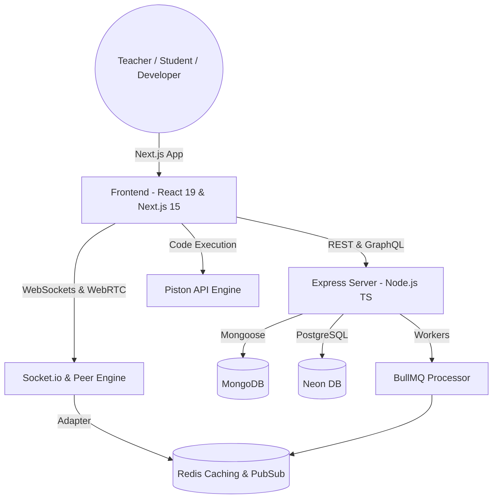

# <div align="center"><br/>CODIE</div>

<div align="center">
  
  **The Next-Generation Real-time Collaborative Development & Live Teaching Environment**
  
  [](https://nextjs.org/)
  [](https://react.dev/)
  [](https://nodejs.org/)
  [](https://www.typescriptlang.org/)
  [](https://tailwindcss.com/)
  [](https://kubernetes.io/)

</div>

---

## 🚀 Overview

**CODIE** is an all-in-one, high-performance real-time collaborative code editor and live interactive teaching platform designed for modern developers, educators, and students. Built with a "Scalability First" architecture, CODIE unites code editing, instant execution, live video/audio communication, and interactive line locking into a single seamless environment.

### 🎯 Primary Purpose & Mission

- 🎓 **Interactive Live Teaching**: Teachers and mentors can conduct live coding classes, assign practical exercises, and watch students write code in real-time.
- 🛠️ **Real-time Teacher Interventions**: Instructors can instantly jump into a student's code, lock lines for demonstration, and fix errors live on screen while other students and peers observe.
- 🤝 **All-in-One Developer Hub**: Eliminate context switching! Meet via WebRTC video/audio huddles, discuss in chat, run code in the console, lock edits, and solve problems together—all within the editor.

---

## ✨ Core Features & Recent Enhancements

- 🎥 **WebRTC Video Huddle**: Integrated face-to-face video calls with dynamic layout grids, stream toggles, and seamless room integration right in the editor.
- 🎙️ **Audio Huddle & Waveform**: Low-latency voice calls featuring real-time speaker audio waveform visualizers, participant lists, and hand-raise indicators.
- ⚡ **Live Multi-Language Code Execution**: Compile and run code instantly across multiple programming languages directly in the integrated output console (powered by Piston API).
- 🔒 **Selection & Line Locking**: Lock specific lines or code blocks to guide students step-by-step, conduct live code reviews, and prevent editing collisions.
- 💬 **In-Editor Chat & Access Control**: Built-in room messaging combined with host-controlled join request approvals for secure classroom and team management.
- 🤝 **Real-Time Multi-Cursor Sync**: Collaborative editing powered by Monaco Editor, Socket.io, and Redis with presence badges and live cursor tracking.
- 🤖 **AI-Powered Code Assistance**: Integrated AI explanations and optimization suggestions to accelerate learning and debugging.
- 🌐 **Project Discovery & Community Sharing**: Browse, fork, comment on, and showcase open-source projects created by the community.
- 💳 **Subscription & Premium Access**: Tiered subscription management and secure payments powered by Razorpay.

---

## 🛠️ Technical Stack

### **Frontend (Client)**
- **Framework**: Next.js 15 (App Router), React 19
- **State Management**: Zustand, React Query (TanStack Query v5)
- **Styling**: Tailwind CSS 4, Framer Motion
- **UI Components**: Radix UI Primitives, Lucide Icons
- **Editor & Media**: Monaco Editor, WebRTC (PeerJS / Native WebSockets), Canvas Audio Waveforms
- **Real-time**: Socket.io-client

### **Backend (Server)**
- **Runtime**: Node.js, TypeScript
- **APIs**: REST (Express), GraphQL (Apollo Server 4)
- **Database**: 
  - **Primary Document DB**: MongoDB (Mongoose)
  - **Relational DB**: Neon (PostgreSQL)
- **Code Execution**: Piston API Worker Integration
- **Caching & Queues**: Redis, ioredis, BullMQ
- **Real-time Engine**: Socket.io (with Redis Adapter for multi-instance scaling)
- **Logging**: Pino & Pino-HTTP

### **DevOps & Infrastructure**
- **Orchestration**: Kubernetes (K8s)
- **Containerization**: Docker & Docker Compose
- **Proxy**: Nginx
- **Automation**: Node-cron scheduled tasks

---

## 🏗️ Architecture


```mermaid
graph TD
    User((Teacher / Student / Developer)) -->|Next.js App| Client[Frontend - React 19 & Next.js 15]
    Client -->|REST & GraphQL| Server[Express Server - Node.js TS]
    Client -->|WebSockets & WebRTC| SocketServer[Socket.io & Peer Engine]
    Client -->|Code Execution| Piston[Piston API Engine]
    SocketServer -->|Adapter| Redis[(Redis Caching & PubSub)]
    Server -->|Mongoose| MongoDB[(MongoDB)]
    Server -->|PostgreSQL| Neon[(Neon DB)]
    Server -->|Workers| BullMQ[BullMQ Processor]
    BullMQ --> Redis
```

---

## 🚦 Getting Started

### Prerequisites
- **Node.js**: v20+
- **Database**: MongoDB Instance & Redis Server
- **Docker & Docker Compose** (Optional for Docker Dev stage)

---

### 1. Quick Local Development (From Root Folder)

You can run all three services (**Client**, **Server**, and **Piston Engine**) concurrently from the project root folder with a single command!

#### 📦 Step 1: Install Dependencies
```bash
npm install         # Installs root orchestrator (concurrently, cross-env)
npm run install:all # Installs dependencies for client, server, and piston
```

#### 🚀 Step 2: Start All Services Concurrently (Dev Mode)
```bash
npm run dev
```
> *This will launch **Client (Port 3000)**, **Server (Port 5000)**, and **Local Piston Engine (Port 2000)** in parallel within the same terminal, complete with color-coded process logs!*

---

### 2. Local Production Mode (Using Hosted Render Piston)

To test the production build locally without running a local Piston instance (automatically using the Render-hosted Piston URL 
```bash
# Build both client and server, then run production servers concurrently:
npm run prod:build

# Or if already built, run directly:
npm run prod
```

---

### 3. Available Root Commands

| Command | Action |
| :--- | :--- |
| `npm run dev` | Starts **Client**, **Server**, and **Local Piston** concurrently in development mode |
| `npm run prod` | Starts production **Client** and **Server** concurrently using hosted Render Piston |
| `npm run prod:build` | Builds production assets and starts production **Client** and **Server** |
| `npm run build` | Compiles `server` (`tsc`) and builds production bundle for `client` (`next build`) |
| `npm run install:all` | Installs dependencies across `client`, `server`, and `piston` folders |
| `npm run dev:client` | Starts only the Next.js Frontend Client in dev mode (`http://localhost:3000`) |
| `npm run dev:server` | Starts only the Express/Socket Backend Server in dev mode (`http://localhost:5000`) |
| `npm run dev:piston` | Starts only the local Piston Execution Engine (`http://localhost:2000`) |

---

### 3. Running Services Separately (Manual Option)

If you prefer running services in separate terminal tabs:

#### Step 1: Piston Execution Engine (Port 2000)
```bash
cd piston
npm install
npm run dev
```
> *Note: Runs lightweight Piston-Lite engine on `http://localhost:2000`. JavaScript, Python, and TypeScript work out-of-the-box. For languages requiring local compilers (Java `javac`, Go `go`, C++ `g++`), ensure they are installed on your system PATH or use Docker Piston.*

#### Step 2: Backend Server (Port 5000)
```bash
cd server
npm install
cp .env.example .env  # Ensure PISTON_URL=http://localhost:2000
npm run dev
```

#### Step 3: Frontend Client (Port 3000)
```bash
cd client
npm install
cp .env.example .env.local
npm run dev
```

Open `http://localhost:3000` in your browser to start using CODIE locally!

---

## 📂 Project Structure

```text
CODIE/
├── client/           # Next.js 15 App Router Frontend
│   ├── public/       # Logos & static assets
│   └── src/          # Components, stores, hooks, & pages
│       ├── app/      # Routes: landing, dashboard, editor, discover
│       ├── components/ # Editor components (Huddles, Console, Lock, Chat)
│       ├── context/  # WebRTC & Socket contexts
│       └── stores/   # Zustand stores (Editor, User, Code)
├── server/           # Express & GraphQL Backend
│   ├── src/          # Sockets, DB Models, Services & Controllers
│   └── tsconfig.json
├── piston/           # Lightweight Piston Code Execution Engine
├── k8s/              # Kubernetes manifest files
├── package.json      # Root package orchestrator for concurrent local development
└── README.md         # Documentation
```

---

## 📄 License

Distributed under the **ISC License**. See `LICENSE` for details.

---

<div align="center">
  Built with ❤️ by the CODIE Team
</div>
