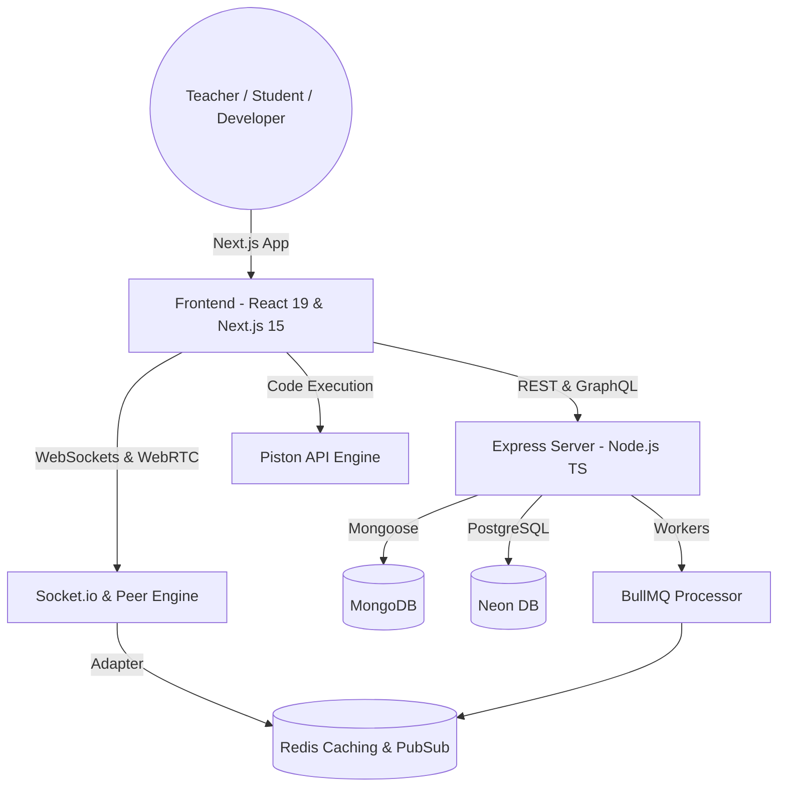

# <div align="center"><br/>CODIE</div>

<div align="center">
  
  **The Next-Generation Real-time Collaborative Development & Live Teaching Environment**
  
  [](https://nextjs.org/)
  [](https://react.dev/)
  [](https://nodejs.org/)
  [](https://www.typescriptlang.org/)
  [](https://tailwindcss.com/)
  [](https://kubernetes.io/)

</div>

---

## 🚀 Overview

**CODIE** is an all-in-one, high-performance real-time collaborative code editor and live interactive teaching platform designed for modern developers, educators, and students. Built with a "Scalability First" architecture, CODIE unites code editing, instant execution, live video/audio communication, and interactive line locking into a single seamless environment.

### 🎯 Primary Purpose & Mission

- 🎓 **Interactive Live Teaching**: Teachers and mentors can conduct live coding classes, assign practical exercises, and watch students write code in real-time.
- 🛠️ **Real-time Teacher Interventions**: Instructors can instantly jump into a student's code, lock lines for demonstration, and fix errors live on screen while other students and peers observe.
- 🤝 **All-in-One Developer Hub**: Eliminate context switching! Meet via WebRTC video/audio huddles, discuss in chat, run code in the console, lock edits, and solve problems together—all within the editor.

---

## ✨ Core Features & Recent Enhancements

- 🎥 **WebRTC Video Huddle**: Integrated face-to-face video calls with dynamic layout grids, stream toggles, and seamless room integration right in the editor.
- 🎙️ **Audio Huddle & Waveform**: Low-latency voice calls featuring real-time speaker audio waveform visualizers, participant lists, and hand-raise indicators.
- ⚡ **Live Multi-Language Code Execution**: Compile and run code instantly across multiple programming languages directly in the integrated output console (powered by Piston API).
- 🔒 **Selection & Line Locking**: Lock specific lines or code blocks to guide students step-by-step, conduct live code reviews, and prevent editing collisions.
- 💬 **In-Editor Chat & Access Control**: Built-in room messaging combined with host-controlled join request approvals for secure classroom and team management.
- 🤝 **Real-Time Multi-Cursor Sync**: Collaborative editing powered by Monaco Editor, Socket.io, and Redis with presence badges and live cursor tracking.
- 🤖 **AI-Powered Code Assistance**: Integrated AI explanations and optimization suggestions to accelerate learning and debugging.
- 🌐 **Project Discovery & Community Sharing**: Browse, fork, comment on, and showcase open-source projects created by the community.
- 💳 **Subscription & Premium Access**: Tiered subscription management and secure payments powered by Razorpay.

---

## 🛠️ Technical Stack

### **Frontend (Client)**
- **Framework**: Next.js 15 (App Router), React 19
- **State Management**: Zustand, React Query (TanStack Query v5)
- **Styling**: Tailwind CSS 4, Framer Motion
- **UI Components**: Radix UI Primitives, Lucide Icons
- **Editor & Media**: Monaco Editor, WebRTC (PeerJS / Native WebSockets), Canvas Audio Waveforms
- **Real-time**: Socket.io-client

### **Backend (Server)**
- **Runtime**: Node.js, TypeScript
- **APIs**: REST (Express), GraphQL (Apollo Server 4)
- **Database**: 
  - **Primary Document DB**: MongoDB (Mongoose)
  - **Relational DB**: Neon (PostgreSQL)
- **Code Execution**: Piston API Worker Integration
- **Caching & Queues**: Redis, ioredis, BullMQ
- **Real-time Engine**: Socket.io (with Redis Adapter for multi-instance scaling)
- **Logging**: Pino & Pino-HTTP

### **DevOps & Infrastructure**
- **Orchestration**: Kubernetes (K8s)
- **Containerization**: Docker & Docker Compose
- **Proxy**: Nginx
- **Automation**: Node-cron scheduled tasks

---

## 🏗️ Architecture


```mermaid
graph TD
    User((Teacher / Student / Developer)) -->|Next.js App| Client[Frontend - React 19 & Next.js 15]
    Client -->|REST & GraphQL| Server[Express Server - Node.js TS]
    Client -->|WebSockets & WebRTC| SocketServer[Socket.io & Peer Engine]
    Client -->|Code Execution| Piston[Piston API Engine]
    SocketServer -->|Adapter| Redis[(Redis Caching & PubSub)]
    Server -->|Mongoose| MongoDB[(MongoDB)]
    Server -->|PostgreSQL| Neon[(Neon DB)]
    Server -->|Workers| BullMQ[BullMQ Processor]
    BullMQ --> Redis
```

---

## 🚦 Getting Started

### Prerequisites
- Node.js v20+
- Docker & Docker Compose
- Redis Server
- MongoDB Instance

### Local Installation

1. **Clone the repository**
   ```bash
   git clone https://github.com/your-username/codie.git
   cd codie
   ```

2. **Backend Setup**
   ```bash
   cd server
   cp .env.example .env
   npm install
   # Seed database for development
   npm run seed:users
   npm run seed:projects
   npm run dev
   ```

3. **Frontend Setup**
   ```bash
   cd ../client
   cp .env.example .env.local
   npm install
   npm run dev
   ```

---

## 📂 Project Structure

```text
CODIE/
├── client/           # Next.js 15 App Router Frontend
│   ├── public/       # Logos & static assets
│   └── src/          # Components, stores, hooks, & pages
│       ├── app/      # Routes: landing, dashboard, editor, discover
│       ├── components/ # Editor components (Huddles, Console, Lock, Chat)
│       ├── context/  # WebRTC & Socket contexts
│       └── stores/   # Zustand stores (Editor, User, Code)
├── server/           # Express & GraphQL Backend
│   ├── src/          # Sockets, DB Models, Services & Controllers
│   └── tsconfig.json
├── k8s/              # Kubernetes manifest files
└── README.md         # Documentation
```

---

## 📄 License

Distributed under the **ISC License**. See `LICENSE` for details.

---

<div align="center">
  Built with ❤️ by the CODIE Team
</div>
